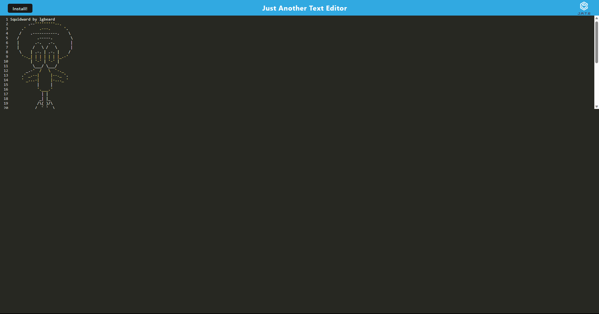

# JATE (AKA text editor using PWA)

- currently not building (still trying to fix)

## Description

This project is a text editor using PWA that is accessed in the browser. Users can create notes and the app is also be avaliable offline by loading via Heroku and clicking the downloadable app button in the browser bar to install.

Heroku link: N/A - as of right now

## Installation

Clone the repo and run an `npm i` then proceed to run `npm run install` to install jate.
After that run `npm run start / npm start`. The app should then be avaliable via the link in the console.
If loading via Heroku, click the downloadable app button in the browser bar to install.

## Usage

When in the app, go ahead and start creating your text files from a browser.

Below screenshot uses ASCII art from (https://www.asciiart.eu/cartoons/spongebob-squarepants)

## Credits

Sameer Mirza | Columbia Coding Bootcamp
